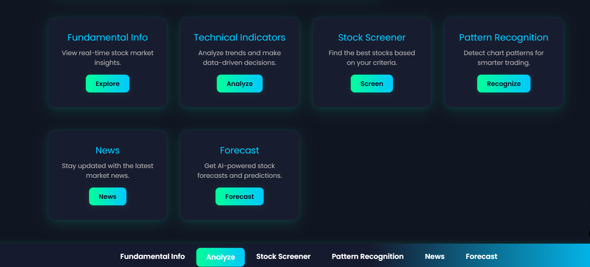
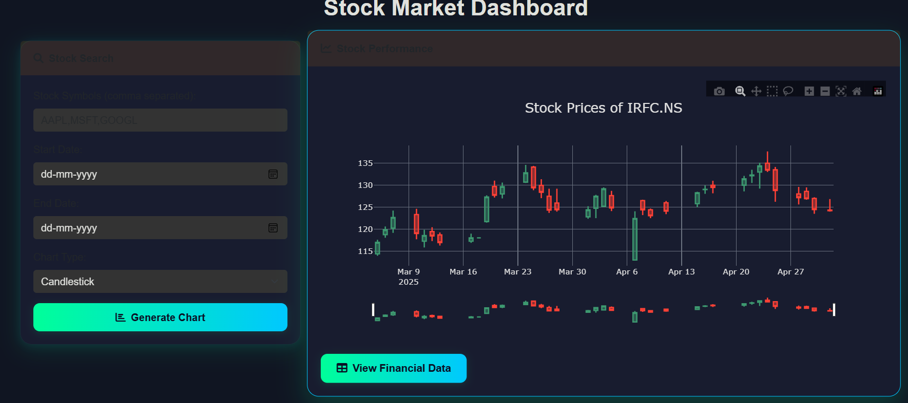
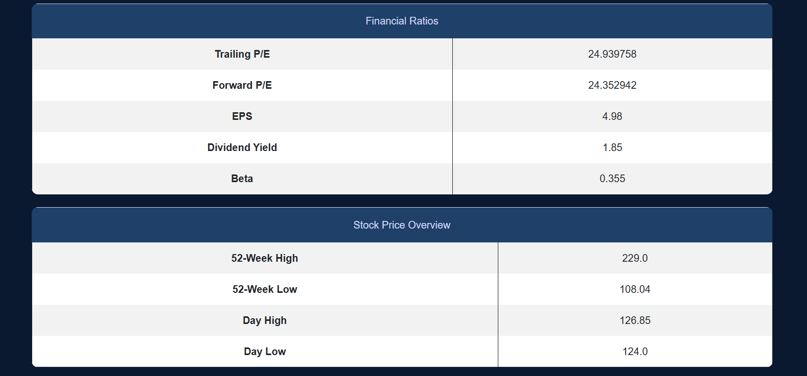
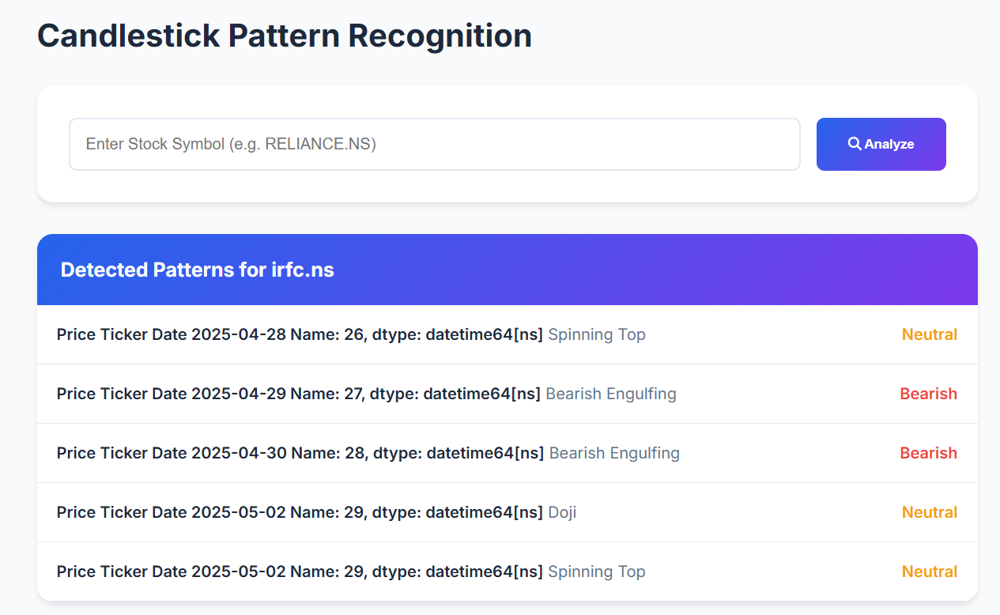
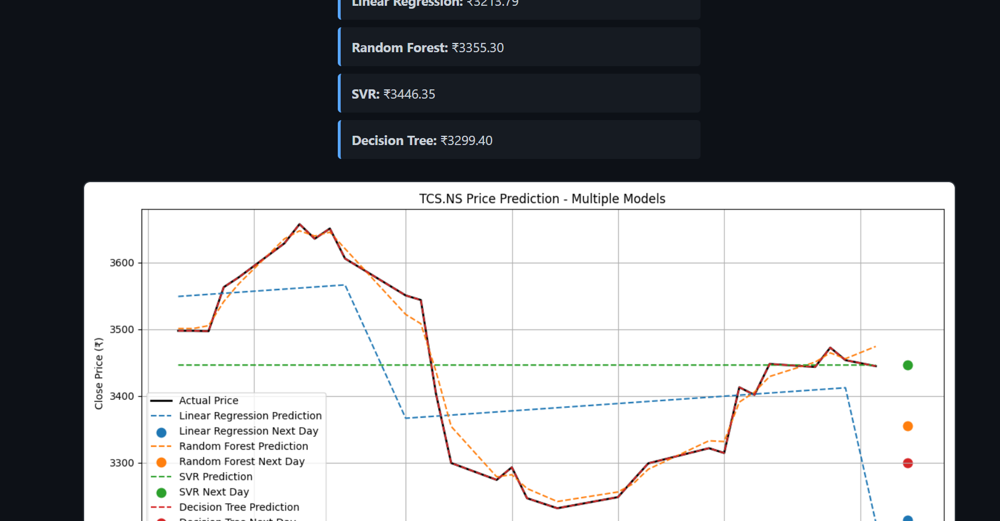

# Stock Analysis Dashboard

A Django-based web application for stock analysis, technical indicators, candlestick pattern recognition, and stock forecasting using machine learning models.

## 🔧 Tech Stack

[](https://www.python.org)&nbsp;
[](https://www.djangoproject.com/)&nbsp;
[](https://pypi.org/project/yfinance/)&nbsp;
[](https://scikit-learn.org/)

---



## Features

- **User Authentication:** Register, login, and logout securely
- **Interactive Stock Price Charts:** Candlestick and line charts
- **Technical Indicators:** RSI, MACD, Bollinger Bands, and more
- **Candlestick Pattern Detection:** Bullish Engulfing, Bearish Engulfing, Hammer, Doji, etc.
- **Stock Screener:** Analyze stocks with key financial metrics
- **Stock Price Forecasting:** Multiple machine learning models (Random Forest, SVM, Decision Tree, Linear Regression)
- **Download & Store Historical Data:** Efficient CSV storage for fast access

## Demo


## Requirements

- Python 3.8+
- Django
- yfinance
- pandas
- numpy
- scikit-learn
- matplotlib
- plotly
- mplfinance
- TA-Lib
- xgboost (optional)

## Setup Instructions

1. **Clone the repository:**
    ```bash
    git clone <your-repo-url>
    cd <your-repo-directory>
    ```
2. **Install dependencies:**
    ```bash
    pip install -r requirements.txt
    ```
3. **Run migrations:**
    ```bash
    python manage.py migrate
    ```
4. **Start the development server:**
    ```bash
    python manage.py runserver
    ```
5. **Access the app:**
    Open your browser and go to [http://127.0.0.1:8000/](http://127.0.0.1:8000/)

## Usage

- Register and log in to access the dashboard.
- Enter stock symbols to view charts and technical indicators.
- Use the screener to analyze financial metrics.
- Forecast stock prices using the forecasting tool.

## Folder Structure

- `stocks/stock_data/views.py` - Main Django views and logic
- `stocks/stock_data/templates/stock_data/` - HTML templates
- `stocks/stock_data/static/charts/` - Example images and chart outputs
- `stocks/stock_data/models.py` - Django models

## Example Screenshots

### Dashboard


### Candlestick Chart


### Stock Screener


### Pattern Recognition


### Forcast


## License

MIT License

---

*This project is for educational purposes. Please do your own research before making investment decisions.*